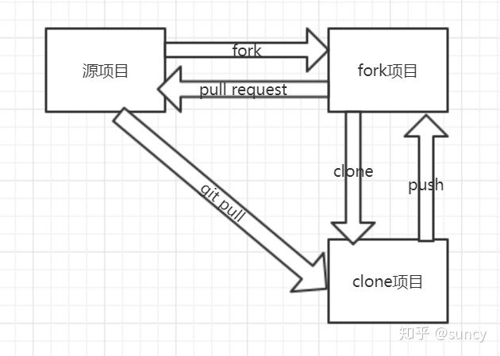

# pull_request

参考: 
- [知乎](https://zhuanlan.zhihu.com/p/45473677)
- [简书](https://www.jianshu.com/p/4f4c04c6e98b)



在GitHub上看到一个库如果有bug, 可以可通pull request的方式修改好后请作者合并代码

1. 在github页面上, 点击fork按钮, 将项目(A)拷贝一份到自己的代码仓库中(B).
2. 克隆B到本地
```
$ git clone https://github.com/B/B.git
```
3. 指定B的upstream为A
```
$ git remote add upstream https://github.com/A/A.git
```
添加好后, 可以使用命令`git remote -v`查看

4. 在本地更改代码（增删查等操作）
5. 暂存代码
修改好了接着要提交了, 在此之前最好先暂存一下本地修改的代码
```
git stash
```
6. 拉取源项目最新代码到本地
```
git pull upstream master # upstream是原远程仓库名, master是原远程分支
或:
git fetch upstream master
git merge upstream master
```
7. add/commit/push 到自己的仓库中
```
git add 修改的东西
git commit -m "提交的信息"
git push origin master # 提交到自己的远程仓库中
```
8. 把pull request推送到原项目让原作者审核(Preview, 即PR)
注: 如果是gitlab, 可能叫"merge request"