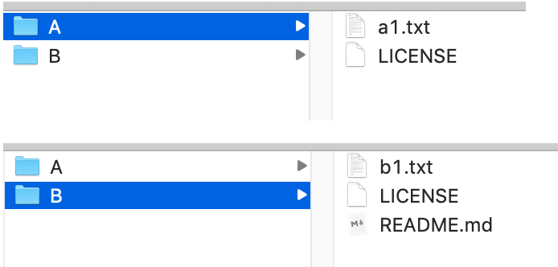

# submodule

参考链接：
[https://www.jianshu.com/p/0107698498af](https://www.jianshu.com/p/0107698498af)
[https://git-scm.com/book/zh/v2/Git-%E5%B7%A5%E5%85%B7-%E5%AD%90%E6%A8%A1%E5%9D%97](https://git-scm.com/book/zh/v2/Git-%E5%B7%A5%E5%85%B7-%E5%AD%90%E6%A8%A1%E5%9D%97)

### addmodule

为了演示git的submodule功能，先在github上新建两个项目: A和B，准备让A作为B的submodule



把A作为B的submodule， 进入到B目录中， 让B add submodule:
`$ git submodule add https://github.com/ACommonChinese/A.git`

这样做之后，在B目录里就有了A, 同时，在B目录里多了一个文件.gitmodules, 这个.gitmodules是一个配置文件，记录mapping between the project's URL and the local subdirectory.


进入到B目录：

```
$ ls -a
.		.git		.gitmodules	LICENSE		b1.txt
..		.gitignore	A		README.md

$ cat .gitmodules 
[submodule "A"]
	path = A
	url = https://github.com/ACommonChinese/A.git
```

### 克隆含有submodule的子项目

`$ git clone https://github.com/ACommonChinese/B.git`

这样clone之后，B下面出现了A文件夹，但此文件夹是空的
进入到B目录：

```
$ git submodule init
Submodule 'A' (https://github.com/ACommonChinese/A.git) registered for path 'A'
git submodule update
Cloning into '/Users/banma-623/Desktop/TODO/TestSubModule/TestCloneB/B/A'...
Submodule path 'A': checked out '25362beb9d93a3608e24796af2295ed7837220d1'
```

update之后，A的东西被pull了下来. 

简便方法：
如果给 git clone 命令传递 --recursive 选项，它就会自动初始化并更新仓库中的每一个子模块。
`$ git clone --recursive https://github.com/ACommonChinese/B.git`

### 在包含子模块的项目上工作

先来看一下拉取上游修改。假设我们在B项目中工作，由于B项目把A项目作为submodule, 有可能在某个时刻，A项目被人修改了，假设我们在github页面上修改A项目中的文件a1.txt, 那么可以这样拉取上游修改合进到B：
首先，进入到A目录：cd /Users/.../B/A

```
$ git fetch
remote: Enumerating objects: 5, done.
remote: Counting objects: 100% (5/5), done.
remote: Compressing objects: 100% (2/2), done.
remote: Total 3 (delta 1), reused 0 (delta 0), pack-reused 0
Unpacking objects: 100% (3/3), done.
From https://github.com/ACommonChinese/A
   25362be..e5ab3c5  master     -> origin/master

$ git merge origin master
Updating 25362be..e5ab3c5
Fast-forward
 a1.txt | 1 +
 1 file changed, 1 insertion(+)
```

可以回到B目录主项目查看:

```
$ git diff --submodule
Submodule A 25362be..e5ab3c5:
  > Update a1.txt
  > 
```

上面拉取上游修改是先进入到子项目B中操作的，如果不想在子目录B中手动fetch与merge，也可以在A目录中，调用命令:
`git submodule update --remote A`
Git 会自动进入子模块然后抓取并更新：

```
$ git submodule update --remote A
remote: Enumerating objects: 5, done.
remote: Counting objects: 100% (5/5), done.
remote: Compressing objects: 100% (2/2), done.
remote: Total 3 (delta 1), reused 0 (delta 0), pack-reused 0
Unpacking objects: 100% (3/3), done.
From https://github.com/ACommonChinese/A
   e5ab3c5..5e01f2d  master     -> origin/master
Submodule path 'A': checked out '5e01f2d9f5b1fa68fdfc15023b5996734bcffbdd'
```

此命令默认会假定你想要更新并检出子模块仓库的 master 分支。 不过你也可以设置为想要的其他分支。 例如，想要子模块A跟踪"dev-2.3"分支，那么既可以在 .gitmodules 文件中设置（这样其他人也可以跟踪它）,也可以只在本地的 .git/config 文件中设置。 推荐在 .gitmodules 文件中设置它。

准备工作：为A建dev-2.3分支
我们先clone一份A，并通过命令为A新建一个分支，比如：dev-2.3
进入到A目录：

```
$ git branch # 查看分支
* master

$ git checkout -b dev-2.3 # 创建本地dev-2.3分支
Switched to a new branch 'dev-2.3'

$ git push --set-upstream origin dev-2.3 # 把本地dev-2.3分支推送到远程
Enumerating objects: 12, done.
Counting objects: 100% (12/12), done.
Delta compression using up to 4 threads
Compressing objects: 100% (10/10), done.
Writing objects: 100% (12/12), 2.61 KiB | 2.61 MiB/s, done.
Total 12 (delta 3), reused 0 (delta 0)
remote: Resolving deltas: 100% (3/3), done.
remote: 
remote: Create a pull request for 'dev-2.3' on GitHub by visiting:
remote:      https://github.com/ACommonChinese/A/pull/new/dev-2.3
remote: 
To https://github.com/ACommonChinese/A.git
 * [new branch]      dev-2.3 -> dev-2.3
Branch 'dev-2.3' set up to track remote branch 'dev-2.3' from 'origin'.

接下来在这个dev-2.3上改一点东西，然后push上去：
git add *
git commit -m "changed on dev-2.3"
git push origin dev-2.3
```

如果这个时候我们回到B目录，调用$ git submodule update --remote，上面的修改是没有被拉进来的。因此需要子模块A跟踪"dev-2.3"分支：

进入到B目录修改.gitmodules文件：

`$ git config -f .gitmodules submodule.A.branch dev-2.3`

这样配置之后，查看.gitmodules:

```
$ cat .gitmodules 
[submodule "A"]
	path = A
	url = https://github.com/ACommonChinese/A.git
	branch = dev-2.3
```

然后就可以update了：

```
liuweizhendeMacBook-Pro-2:B liuweizhen$ git submodule update --remote
Submodule path 'A': checked out 'aacd5e74ed7ff6a6d28b78b221c7dc4bbed7ddc4'
```

查看修改：进入B目录

```
$ git config status.submodulesummary 1 # 让git显示你的子模块的更改摘要
$ git status
On branch master
Your branch is up to date with 'origin/master'.

Changes not staged for commit:
  (use "git add <file>..." to update what will be committed)
  (use "git checkout -- <file>..." to discard changes in working directory)

	modified:   .gitmodules
	modified:   A (new commits)

Submodules changed but not updated:

* A 25362be...aacd5e7 (1):
  > changed on dev-2.3
```

当运行` git submodule update —remote` 时，Git 默认会尝试更新所有子模块，所以如果有很多子模块的话，你可以传递想要更新的子模块的名字。


### 在子模块上工作

下面演示如何在子模块与主项目中同时做修改，以及如何同时提交与发布那些修改。

到目前为止，当我们运行 `git submodule update` 从子模块仓库中抓取修改时，Git 将会获得这些改动并更新子目录中的文件，但是会将子仓库留在一个称作 “游离的 HEAD” 的状态。`git submodule update`后可以进入到B通过命令查看：

```
$ git branch
* (HEAD detached at 25362be)
  dev-2.3
  master
```

这意味着没有本地工作分支（例如 “master”）跟踪改动， 所以任何改动都不会被跟踪。
为了将子模块设置得更容易进入并修改，需要做两件事。 
1. 进入每个子模块并检出其相应的工作分支 
```
$ cd Users/xxx/.../B   $ git checkout dev-2.3
```
2. 若你做了更改就需要告诉 Git 它该做什么，然后运行 git submodule update --remote 来从上游拉取新工作，假如上游子repo A发生了变化，进入到B目录：

```
$ git submodule update --remote --merge
remote: ...
Unpacking objects: 100% (3/3), done.
From https://github.com/ACommonChinese/A
   87ca9c0..c077bcc  dev-2.3    -> origin/dev-2.3
Updating 87ca9c0..c077bcc
Fast-forward
 a1.txt | 9 +++++++++
 1 file changed, 9 insertions(+)
Submodule path 'A': merged in 'c077bcc29dd25fa13576e426bdbc9a725f297f0c'
```

**发布子模块改动**

如果我们在主项目中提交并推送但并不推送子模块上的改动，其他尝试检出我们修改的人会遇到麻烦，因为他们无法得到依赖的子模块改动。 那些改动只存在于我们本地。

最简单的选项是进入每一个子模块中然后手动推送到远程仓库，确保它们能被外部访问到，之后再次尝试push主项目。


