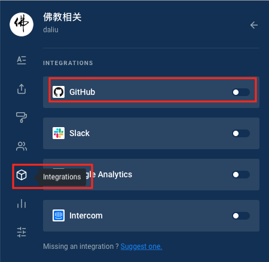

# GitBook

这是GitBook的官网\([https://docs.gitbook.com/faq](https://docs.gitbook.com/faq)\)，新版的GitBook发生了一些变化，book的观念现在变成了space的观念，可以简单的把以前的book理解成现在的space。而且新版GitBook本身不再为每个book建相应的git repository，我们integration的时候推荐把内容关联到GitHub上去。GitBook的具体教程可以在官网或其他一些好的地方参考，比如[http://www.chengweiyang.cn/gitbook/](http://www.chengweiyang.cn/gitbook/ "这里")

本文简要介绍使用GitBook的使用方法，纯属个人备记，我对自己写的东西很自信，里面的内容不是可能有错误，是肯定会有错误，乘客请小心坐车。

集成github示图：首先进入到书籍

可以把gitbook的space关联到github上的一个repo，gitbook会注册一个webhook, 当repo发生变化时，gitbook对应的书籍(space)内容也会发生变化。

需要注意的是，在关联github的repo时，gitbook如果没有权限，是不会列出github上你的organization中的repo的，如果想对接github上的organization的repo，需要权限：
授权 [https://github.com/settings/connections/applications/e103ee3796d447fab74c](https://github.com/settings/connections/applications/e103ee3796d447fab74c)

[参见这里：](https://github.com/GitbookIO/help.gitbook.com/blob/master/github/why-is-my-organization-not-listed.md)

授权完成后，需要到[设置](https://legacy.gitbook.com/login?next=%2Fsettings%2Fgithub)页面重新登录。